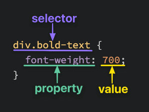
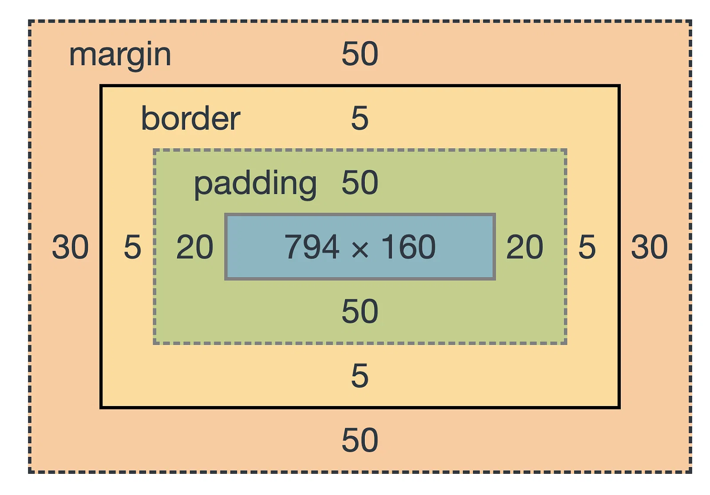

# HTML Basis

## Some elements

`<!-- I'm a comment -->`

`<h1> to <h6>`

`<p>`

`<br>`

`<strong>` -> bold

`<em>` -> italic
`<strong>` -> bold
`<strong>` -> bold


`<ul>` -> unordered list

`<ol>` -> ordered list

`<li>` -> list item

`<a href="" target="" rel="noopener noreferrer>` -> hyperlink, target attribute specifies where the link will be opened (current or new tab for example)

``

`<audio> <video>`

`<table>`

`<form>` -> collect user input

`<div>` -> container in columns

`<span>` -> text container in lines `My mother has <span style="color:blue">blue</span> eyes.`

`<header> <footer>`

## Basic HTML Page
```
<!DOCTYPE html>
<html lang="en">
  <head>
    <meta charset="UTF-8">
    <title>My First Webpage</title>
  </head>

  <body>
    <h1>Hello World!</h1>
  </body>
</html>
```
Generate it by taping ! on an empty html file in VSCode


# CSS Basis

## 3 ways to link CSS to an HTML element

1. Inline: `<span style="color:blue">`
2. Intern: `<style>` in `<header>` for the whole page
3. Extern: CSS written in a separated file, we need to add `  <link rel="stylesheet" href="styles.css">` in the HTML headers

## Basic syntax



## Selectors

1. Universal selector
```
* {
  color: purple;
}
```

2. Type selector
```
div {
  color: white;
}
```

3. Class selector
```
<div class="alert-text">Hey !</div>

.alert-text {
  color: red;
}
```

4. ID selector
```
<div id="title">My title</div>

#title {
  background-color: red;
}
```

5. Grouping selector
```
#title,
.alert-text {
  background-color: red;
}
```

6. Chaining selector
```
.subsection.header {
  color: red;
}
```
Select only elements that has both the subsection and header classes

7. Descendant combinator
Select an element of class contents with ancestor of class ancestor
```
.ancestor .contents {
  /* some declarations */
}
```

## CSS Cascade

Defines which CSS property is selected for an HTML element if multiple are defined

[Odin course on cascade](https://www.theodinproject.com/lessons/foundations-the-cascade)

## Some properties
`color: #100ff; color: rgb(42, 42, 42)`

`font-family font-size font-weight`

`text-align`

`height width`

`display` -> block (default) to stack vertically, inline-block to stack horizontally, grid, flex, ...

`justify-content: space-between/...`

`align-items: center/...`

`position` -> static, relative, absolute, fixed or sticky

`z-index` -> superposition order

## Box model



## Pseudo stuff

### Pseudo elements

"Pseudo-elements act as if you had added a whole new element to the DOM, and enable you to style that."

```
selector::pseudo-element {
  property: value;
}

p::first-line {}
div::before {} -> Create the first child of the selected element, often use with the content property
div::after {} -> Same as before for the last child
...
```

### Pseudo classes

Target an element when it's in a particular state

```
selector:pseudo-class {
  property: value;
}

div:hover {}
div:fovus {}
...
```

## Flexbox

A flex container has `display: flex` and flex items have `flex` property.

`flex` is a shorthand for
1. `flex-grow` -> growth factor when resizing
2. `flex-shrink` -> shrink factor
3. `flex-basis` -> initial size

`flex: 1` is equivalent to `flex: 1 1 0`.

`flex: auto` is equivalent to `flex: 1 1 auto`.

`flex-direction: row/column` in the container properties

`gap` to add space between flex items


